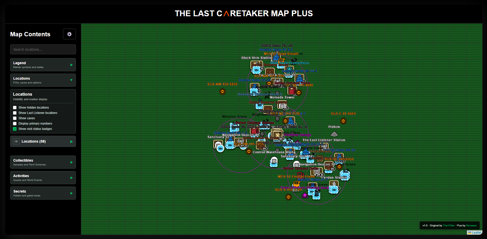
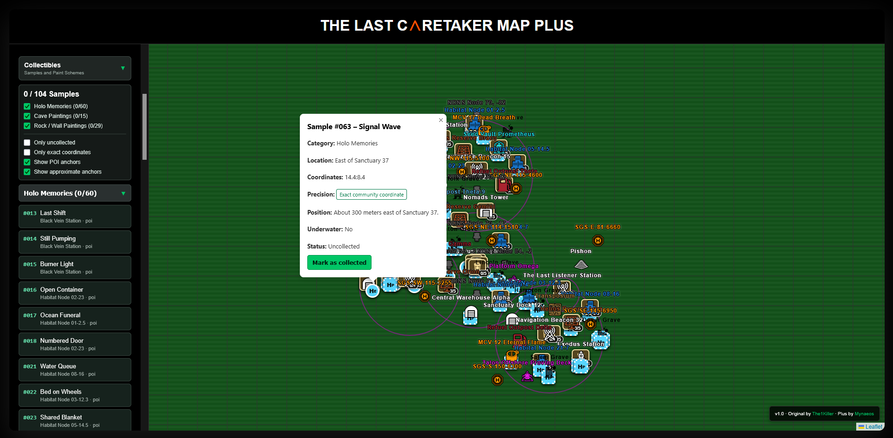
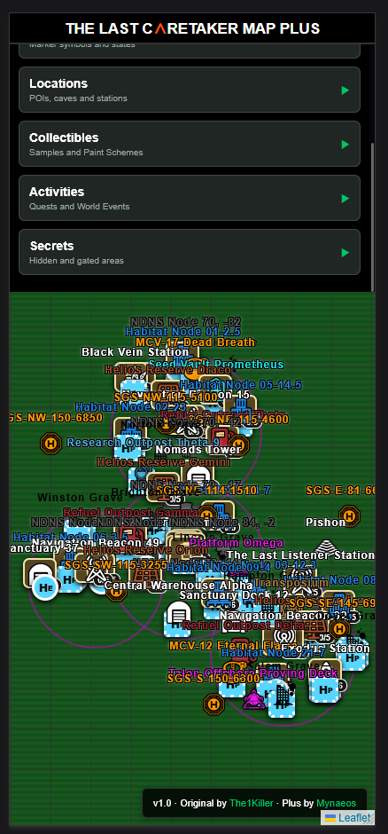

# The Last Caretaker Map Plus

An extended community edition of The Last Caretaker Map, built with Leaflet and
Vite.

The original map was created by The1Killer. The Plus edition and its additional
datasets are maintained by [Mynaeos](https://www.youtube.com/@mynaeos).

This is an unofficial fan project for
[The Last Caretaker](https://thelastcaretaker.com/) by
[Channel37](https://www.channel37.co/). It is not affiliated with or endorsed by
Channel37.

> **Maintenance status:** This repository remains online as the stable legacy
> map and reference dataset. After the final verified data refresh, future
> *The Last Caretaker* data development continues in the successor website
> project.

## Screenshots



*Default desktop view with location controls and grouped map markers.*



*Collectibles view with searchable Holo Memories and an individual sample popup.*

<p align="center">
  
</p>

<p align="center"><em>Compact mobile layout with a scrollable menu and expanded map area.</em></p>

## Features

- Interactive map with searchable locations and category filters
- Per-location visibility, visited/cleared status, and personal notes
- 104 Holo Memories, cave paintings, and rock/wall paintings
- 37 paint schemes with individual can and unlock progress
- Quest starts, optional objective markers, and Project Jonah world events
- Secrets and gated areas with staged hint and solution reveals
- Marker legend and configurable marker colors
- Local backup and restore for preferences, notes, and completion progress
- Responsive layout for desktop and mobile browsers

All personal progress is stored in the browser's local storage. The project does
not include Google Analytics or another analytics service.

## Requirements

- Node.js 22.12 or newer (Node.js 22 LTS recommended)
- npm

No global npm packages are required.

## Run locally

Install dependencies once:

```powershell
npm install
```

Start the Vite development server at <http://localhost:3001/>:

```powershell
npm run dev
```

Create a production build:

```powershell
npm run build
```

Preview the production build:

```powershell
npm run preview
```

The generated production files are written to `dist/`.

## Validate map data

Run the validators after changing a dataset:

```powershell
npm run validate:samples
npm run validate:paints
npm run validate:quests
npm run validate:secrets
npm run validate:icons
```

Run the complete validation suite with `npm run validate:all`.

Detailed source notes and known uncertainties are documented in
`SOURCES_AND_UNCERTAINTIES.md` and the catalog files under `src/data/`.

Coordinate precision has the following meaning:

- `exact`: a published coordinate for the specific find
- `poi`: a POI, cave entrance, or search-area anchor
- `approximate`: an approximate community position or broader search anchor

## Project structure

```text
public/images/              Map and marker images
scripts/                    Dataset validators
src/data/                   Locations and Plus datasets
src/main.js                 Map, location, search, and sidebar logic
src/samples.js              Sample markers and collection progress
src/paints.js               Paint scheme markers and progress
src/quests.js               Quest and world-event markers
src/secrets.js              Secret markers and staged reveals
src/settings.js             Preferences and backup/restore
src/styles.scss             Application styles
index.html                  Main interface
vite.config.js              Development and build configuration
```

Stable dataset IDs must not be changed after publication because browser progress
is associated with them.

## Credits and license

- Original map: [The1Killer](https://github.com/the1killer/LastCaretakerMap)
- Plus edition and additional data integration: [Mynaeos](https://www.youtube.com/@mynaeos)
- In-game map/POI icons used with permission from [Channel37](https://www.channel37.co/)

Source code derived from the original map remains available under the BSD
2-Clause License in `LICENSE`. Rights to the game, its names, and game-derived
artwork remain with their respective owners.

See [THIRD_PARTY_NOTICES.md](THIRD_PARTY_NOTICES.md) for the distinction between
the source-code license and the separately permitted in-game POI icons.
